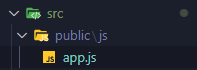
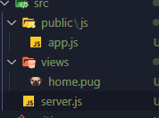
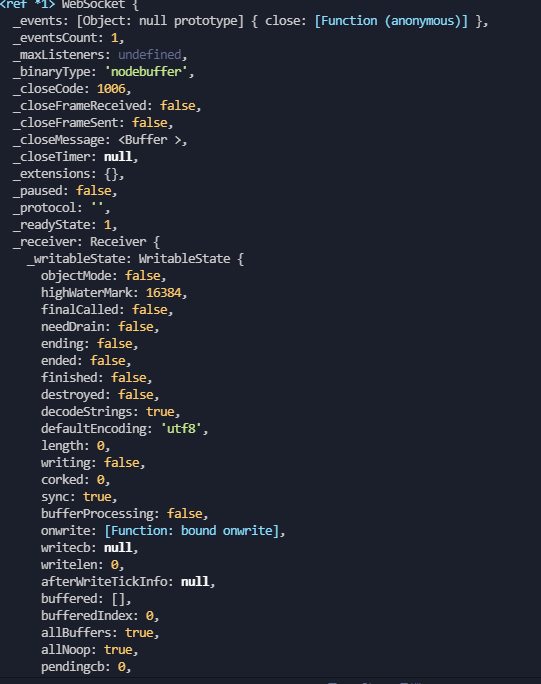

# Zoom clone coding


## course 0

### 사전 node 설정

사전 설정

```bash
$ npm init -y
```


package.json

> main, script 삭제 ++ 아래처럼 만들어주세요

```json
{
  "name": "zoom",
  "version": "1.0.0",
  "description": "Zoom Clone using WebRTC and Websockets",
  "license": "MIT"
}
```

nodemon 설치

``` bash
$ npm i nodemon -D
```


babel.config.json, nodemon.json 생성

src 폴더 생성

src 폴더 내부 server.js 생성

src/sever.js

```javascript
console.log('hello')
```


```bash
$ git init // 레포 형성용
$ npm i @babel/core @babel/cli @babel/node -D
```


**.gitignore 생성**

```gitignore
/node_modules
```

node_modules 제외처리 


**nodemon.json 명령어 입력**

```json
{
  "exec" :" babel-node src/server.js"
}
```

이 exec를 통해 하나의 명령만 수행하게 할 것이다.


babel.config.json

```json
{
  "presets": ["@babel/preset-env"]
}
```

 해주고 난 후

```bash
$ npm i @babel/preset-env -D
```

실행


####  정리

package.json 에 필요한 것들은 입력되어있습니다.

nodemon 에는 "exec" 라는 key 하나만 있는데 src/server.js 에 대해 babelnode 명령문을 실행시키는 코드입니다.

babel.config.json 에는 우리가 사용할 유일한 "preset"이 입려되어 있습니다.

package.json 에는 "script"를 넣어 줄 예정

dev 는nodemon을 호출함  -> nodemon은 nodemon.json을 살펴보고 거기코드 실행

준비 끝!!!


express 설치

```bash
$ npm i express pug
```


server.js 파일 오픈

```json
import express from "express" //파일에 불러오기
```

우리의 앱을 만들어줄것임

```javascript
import express from "express"

const app = express(); // app 이 express를 상속받음 express 와 같은동작

console.log("hello"); // hello 출력

app.listen(3000); // 포트 3000 을 듣게 해줄 코드

```


바벨 참조 오류

```bash
$ npm i @babel/node -g
```


http://localhost:3000/ 에서 서버 구동 확인


### Frontend Setup


> static files 또는 유저들에게 가게 될 파일들을 만들어 볼 예정



생성


pug 페이지들을 렌더하기위해 pug 설정을 해 주어야한다.


server.js

```javascript
import express from "express"

const app = express();

app.set( "view engin", "pug")
app.set( "views", __dirname + "/src.views")

// console.log("hello");

const handleListen = ( ) => console.log("Listening on http://localhost:3000/")

app.listen(3000,handleListen);
```


우리가 사용 할 route 생성



sever.js

```javascript
import express from "express"

const app = express();

app.set("view engine", "pug")
app.set("views", __dirname + "/views")
app.use("/public", express.static(__dirname + "/public"));
// console.log("hello");

app.get("/", (req,res) => res.render("home"));

const handleListen = ( ) => console.log("Listening on http://localhost:3000/")

app.listen(3000,handleListen);

```


http://localhost:3000/public/js/app.js 가서 확인


유저한테만 보여지는 app.js

이 app.js가 바뀔 때 마다, nodemon이 실행됨 

view나 server.js 파일을 수 정하거나 view 의 내용을 수정할때는 새로고침 

내 frontend 영역인 js 부분을  수정할 때는 새로고침 되지 않았으면 좋겠다


nodemon 폴더 하나 무시하게 하기

```json
{
  "ignore" : ["src/public/*"],
  "exec" : "babel-node src/server.js"
}
```


**Mvp css 기본 html 태그를 이쁘게 만들어줌 헤더에 추가**

`<link rel="stylesheet" href="https://unpkg.com/mvp.css">`


views/home.pug

```pug
doctype html
html(lang="en")
  head
    meta(charset="UTF-8")
    meta(http-equiv="X-UA-Compatible", content="IE=edge")
    meta(name="viewport", content="width=device-width, initial-scale=1.0")
    title Noom
    link(rel="stylesheet", href="https://unpkg.com/mvp.css")
  body 
    header
      h1 Noom
    main 
      h2 Welcome to Nomm
    button call
    script(src="/public/js/app.js") -> 경로의 파일 import
```


server.js

```javascript
import express from "express"

const app = express();

app.set("view engine", "pug")
app.set("views", __dirname + "/views")
app.use("/public", express.static(__dirname + "/public"));
// console.log("hello");


app.get("/", (req,res) => res.render("home"));
app.get("/*", (req,res) => res.redirect("/")) // 이외의 주소는 뒷 주소로 리다이렉트


const handleListen = ( ) => console.log("Listening on http://localhost:3000/")

app.listen(3000,handleListen);
```


---


## course 1

 


### HTTP vs WebSockets


webSockets

악수와 마찬가지 요청보내고 수락 과정이되면 연결되어있기 때문에 실시간으로 소통이 가능해짐


bi-directional 이라는 특징 때문이다. 양방향이라는말


연결중일때만 가능하다 따라서 직접 접근할 수 있다.


브라우저에는 내장된 websocket가 있고 이를 사용할것


### node.js 로 WebSocket server 만들기


protocole 어떻게 모든것이 돌아가야할지에 대한 규칙을 만듬

프로그래머는 이 규칙을 가지고 이 규칙을 따르는 코드를 녹여내야함


ws 는 코어다 가장 핵심중 한가지, 하지만 이를 이용해 모든 logic을 구현할 필요는 없다

이를 이용한 framework를 찾아서 chat기능을 구현 할 예정 이는 ws 뿐만 아니라 다른기능들도 포함되어 있다.


설치

```bash
$ npm i ws
```


서버 만들기 

express 서버를 놓고 합칠 것이다.

ws 와 express 는 다른 서버인데 이를 합쳐서  같은 서버에서 기능하도록 해줄것임


이를 위해 우리는 무엇을 바꾸어 줄것인가?

expresss의 경우 ws를 지원하지 않는다


function 을 추가해야함

```javascript
import http from "http" // http import
import express from "express" 
import WebSocket from "ws"; // ws import

const app = express();

app.set("view engine", "pug")
app.set("views", __dirname + "/views")
app.use("/public", express.static(__dirname + "/public"));
// console.log("hello");


app.get("/", (req,res) => res.render("home"));
app.get("/*", (req,res) => res.redirect("/"))


const handleListen = ( ) => console.log("Listening on http://localhost:3000/")


const server = http.createServer(app); // http 서버만들기
const wss = new WebSocket.Server({server}) // ws 서버 만들고 http server 연결

```

꼭 연결할 필요는 없음 하남나 할때는 가장 아래방법만 사용

app.listen과 별 다른게 없어보이지만 http 서버에서 ws 서버도 만들 수 있게 되었다.


### 1.3 WebSocket Events

webSocket을 이용해 backend와 연결하고싶다면 js가 해줄것이다!

설치 할 필요없이 webbrowser 에서 지원이 된다.


webSocket도 event가 있고, event가 발동될 때 사용할 function을 만들면 된다

```javascript
btn.addEventListener("click", fn) // 이것과 유사함
```

event 명에 신경써야 한다.

```javascript
function handelConnection(socket) {
  console.log(socket)
}

// 웹 소켓에도 js처럼 이벤트가 있다.
wss.on("connection",  handelConnection)
// socket을 반납 받는다.. 연결된 브라우저와의 contact 라인이다.
// 소켓을 이용하면 메세지를 주고받을 수 있는데 이를 어딘가에 저장해야한다.
// on 메소드는 backend 에 연결된 사람의 정보를 제공해준다.
```

이제 backend에서의 처리는 끝났다.

frontend 에서 요청을 보내주어야한다. back과의 연결 요청 !

이게 연결 되어야만 우리는 소켓을 볼 수 있다!

```javascript
const socket = new WebSocket(`ws://${window.location.host}`) // 내가 어디에 있는지 알려주는것
```




console.log(socket)에의해  출력된 터미널 창 이제 연결 되었다.


server.js 의 socket 은 연결된 브라우저를 뜻해준다

app.js 의 socket는 backend 로의 연결

쌍방향 연결!


### 1.4 WebSocket Message

backend 에서 connection 안에 새로운 익명함수 생성 및 메시지 보내기

```javascript
wss.on("connection",  (socket)=> {
  console.log(socket);
  // 이제 브라우저에 메세지를 보내보자
  socket.send("hello!!! from back!!")

})
```


에러는 나지 않지만 아무것도 발생 x

왜냐하면 frontend에서 처리 해 주지 않았기 때문이다.


 app.js

```javascript
// 메세지 받기
// 메세지는 이벤트이다.
// 백엔드에서 발생한 이벤트를 받아야지!
socket.addEventListener("open", () => {
  console.log("Connected to Browser 🕶")
})

// 한개 더 추가
socket.addEventListener("message", (message) => {
  console.log("Just got this:", message, " from the server")
})

socket.addEventListener("close", () => {
  console.log("Connected from Server X")
})
```

> 이제 어떻게 작동하는지 봅시다. 


frontend에서 메세지 보내기

```javascript
setTimeoust( () => {
  socket.send("hello from the browser!")
} ,10000)
```


---

중간정리

server.js

```javascript
import http from "http";
import express from "express";
import WebSocket from "ws";

const app = express();

app.set("view engine", "pug")
app.set("views", __dirname + "/views")
app.use("/public", express.static(__dirname + "/public"));
// console.log("hello");


app.get("/", (req,res) => res.render("home"));
app.get("/*", (req,res) => res.redirect("/"))


const handleListen = ( ) => console.log("Listening on http://localhost:3000/")


const server = http.createServer(app); // http 서버만들기
const wss = new WebSocket.Server({server});

// function handelConnection(socket) {
//   console.log(socket)
// }

// 웹 소켓에도 js처럼 이벤트가 있다.
wss.on("connection",  (socket)=> {
  
  console.log("Connected to Browser")
  // console.log(socket);
  // 이제 브라우저에 메세지를 보내보자
  
  socket.send("hello!!! from back!!")

  // 서버로부터 메세지 받기 
  // 창이 닫아지면
  socket.on("close", () => console.log('클라이언트로부터 연결끊김'))
  socket.on("message", (message) => {
    console.log(message.toString('utf8'))
  })

})
// socket을 반납 받는다.. 연결된 브라우저와의 contact 라인이다.
// 소켓을 이용하면 메세지를 주고받을 수 있는데 이를 어딘가에 저장해야한다.
// on 메소드는 backend 에 연결된 사람의 정보를 제공해준다.


server.listen(3000, handleListen);
// app.listen(3000,handleListen);

```

app.js

```javascript
const socket = new WebSocket(`ws://${window.location.host}`) // 내가 어디에 있는지 알려주는것

// 메세지 받기
// 메세지는 이벤트이다.
// 백엔드에서 발생한 이벤트를 받아야지!
socket.addEventListener("open", () => {
  console.log("Connected to Browser 🕶")
})

// 한개 더 추가
socket.addEventListener("message", (message) => {
  console.log("Just got this:", message.data, " from the server")
})

socket.addEventListener("close", () => {
  console.log("Connected from Server X")
})

setTimeout( () => {
  socket.send("hello from the browser!")
} ,10000)

```


**서로 연결을 지어주는 과정의 연속이다!**


### 1.5 Recap

이벤트를 리슨하는 과정

한곳은 백 한곳은 프론트


백엔드

> 웹소켓 서버 생성
>
> connection 이라는 이벤트를listen 하고있다.
>
> 이제 어떤 반응을 해주럿인가
>
> 우리는 event를 청취 해 주어야한다.
>
> 그것이 connection 그리고 누가 연결했는지에 관한 정보 socket 에 들어있다
>
> 이제 이 특정 socket이 어떤 행동을 하는지에 따라 반응을 할거기 때문에,
>
> connection 된 socket 에 대해 이벤트를 등록한다. 
>
> 서버에 event를 등록하지 않은 이유 각 브라우저별 이벤트를 위함
>
> 새로운 브라우저가 들어올 때 마다 이 이벤트를 발동시킬 것임


프론트

> backend와의 connection을 열어주고 있음
>
> 그리고 다시 이벤트 리스너를 설정해줌!
>
> js의 이벤트리스너와 유사함
>
> 새로운것이 있다면 프론트가 백으로 메세지를 보낼 수 있음


서로 주고받고 있다.

그럼 각 socket 에 들어있는 이벤트는 어떤것이 있는가?!


백엔드와 프론트엔드의 구별을 잘 해주어야 한다.


### 1.6 Chat Completed

```javascript
function handleSubmit(event) {
  event.preventDefault();
  const input = messageForm.querySelector("input");
  socket.send(input.value)
  input.value = ""
  // console.log(input.value)
}

messageForm.addEventListener("submit", handleSubmit)
```

console.log하면 frontend의 콘솔에 출력됨


messageForm 작성하고 이벤트리스너를 추가해준다.

submit 이벤트가 발생했을 때, handleSubmit 함수를 실행시켜주고,

input의 value 값을 가져온다

그리고 console에 출력 --> socket을 통해 backend 에전달 로 바뀐 것 뿐 나머지 작동 과정은 동일하다.


백에서 받은 메세지를 그대로 다시 프론트에게 전달!

server.js

```javascript
wss.on("connection",  (socket)=> {
  
  console.log("Connected to Browser")
  // console.log(socket);
  // 이제 브라우저에 메세지를 보내보자
  
  socket.send("hello!!! from back!!")

  // 서버로부터 메세지 받기 
  // 창이 닫아지면
  socket.on("close", () => console.log('클라이언트로부터 연결끊김'))
  socket.on("message", (message) => {
    // console.log(message.toString('utf8'))
    socket.send(message.toString('utf8')) // 다시 프론트에게 받은 메시지를 전달
  })
```


각 브라우저는 서버랑 연결되어 주고받을 수 있지만, 각 브라우저끼리는 메세지를 주고받지 못한다.

 즉 우리의 문제점은 누가 연결되었는지를 모른다.


그래서 우리는 Fake database를 만들어줄것이다.

누군가 우리 서버에 연결하면, 그 connection을 가짜 Db에 넣어줄것이다


server.js 가짜 db를 이용한 client 간의 message 전달

```javascript
const sockets = [ ]
wss.on("connection",  (socket)=> {
  sockets.pust(socket) // 소켓에 대한 정보가 들어감
  socket.on("message", (message) => {
    sockets.forEach(aSocket => {
      aSocket.send(message.toString('utf8'))
    })
  })

})
```


### 1.7 Nicknames part One

이제 콘솔에 잇는 메세지를 직접 띄워주자!


li를 만들어주고, 그 안에 메세지를 적어준 다음 li를 ul 안으로 넣어주면 된다! (javascript의 영역이네요)

```javascript
// 한개 더 추가
socket.addEventListener("message", (message) => {
  // console.log("Just got this:", message.data, " from the server")
  const li = document.createElement("li")
  li.innerText = message.data;
  messageList.append(li)
})
```


이제 닉네임을 정할 수 있게 form을 만들어주자 

```pug
doctype html
html(lang="en")
  head
    meta(charset="UTF-8")
    meta(http-equiv="X-UA-Compatible", content="IE=edge")
    meta(name="viewport", content="width=device-width, initial-scale=1.0")
    title Noom
    link(rel="stylesheet", href="https://unpkg.com/mvp.css")
  body 
    header
      h1 Noom
    main
      ul
      form
        input(type="text", placeholder="Choose nickname". required)
        button Save
      form
        input(type="text", placeholder="write a msg". required)
        button send
    script(src="/public/js/app.js") 
```


:heavy_check_mark: 여기서 문제점! backend는 message들을 구분하지 못한다!

왜냐하면 우리가 메세지를 보낼 때, 그냥 모두에게 보내고 있기 때문이다.

메시지를 구별하는 방법이 필요함

왜냐하면 어떤 메시지는 내 nickname을 저장하기 위한 메시지일 수 있고

다른 메시지는 chat 에서 다른 사람들에게 보내는 메시지일 수 있기 때문이다.


message 타입을 정해 주어야할 것 같다.

app.js

```javascript
function handleSubmit(event) {
  event.preventDefault();
  const input = messageForm.querySelector("input");
  socket.send(input.value)
  input.value = ""
  // console.log(input.value)
}
function handleNickSubmit(event) {
  event.preventDefault();
  const input = nickForm.querySelector("input");
  socket.send(input.value)
  input.value = ""
  // console.log(input.value)
}

messageForm.addEventListener("submit", handleSubmit)
nickForm.addEventListener("submit", handleNickSubmit)
```

각 form별 다른 메세지를 전달하고 분리 되었지만, 채팅입력과 동일한 취급을 받고 있음

각 type별로 구분이 되어야 할 필요가 있음!

json 형태로 전송 하겠다!

```javascript
function handleNickSubmit(event) {
  event.preventDefault();
  const input = nickForm.querySelector("input");
  socket.send({
    type : "nick",
    payload : input.value
  }) // json 형태로 변경 지금은 string을 보내는것이 아님
  input.value = ""
  // console.log(input.value)
}
```


아직 문제 발생 우리가 원하는 형태의 파일이 아님

string으로 전송해야하는데, json의 형태를 유지하면서 보낼려면 어떻게 보내야 할까?!

그리고 string을 다시 json으로 만들려면 어떻게 하면 좋을까?

 :heavy_check_mark: JSON.stringify(객체) -> ( json to string )

 :heavy_check_mark: JSON.parse(string) -> ( string to json )

 크,.. 주모 뽕이 차오릅니다..

app.js

```javascript
function makeMessage(type, payload) {
  const msg = {tpye, payload};
  return JSON.stringify(msg)
} // 타입과, value를 묶어서 dic으로 생성

function handleSubmit(event) {
  event.preventDefault();
  const input = messageForm.querySelector("input");
  socket.send(makeMessage("new_message",input.value))
  input.value = ""
  // console.log(input.value)
}
function handleNickSubmit(event) {
  event.preventDefault();
  const input = nickForm.querySelector("input");
  socket.send(makeMessage("nickname",input.value)) // json 형태로 변경 지금은 string을 보내는것이 아님
  input.value = ""
  // console.log(input.value)
}
```


### 1.8 Nicknames part Two

이제 server.js에서 type별로 구분하여 저장시켜주자!

여기서 발생 한 문제는 백엔드가 자바스크립 옵젝을 이해못함

백엔드로 jsob으로 보내면 좋지 않다.

why ? 서버는 js 로 만들었는데 누군가는 go로 들어오고 싶어할 수 있기 때문이다.

이러한 이유로 string 형태로 보내 주어야 한다.


왜 object를 못보내주는가?!


websocket 이 브라우저에 있는 api 이기 때문이다.

이제는 우리는 oj -> st 으로 백엔드에 보냈으면 백엔드에선 st -> oj 으로 바꾸어 해석시키고 싶다.


여기서 좋은점!!

:ballot_box_with_check: 메세지의 타입을 정의해서 서버에서 처리할 수 있게 되었다는점!


:ballot_box_with_check: 소켓은 기본적으로 객체다


:heavy_check_mark: 메세지를 여러번 보내면 닉네임이 계속 바뀌는걸 볼 수 있는데, 각 case문 맨 아래에 break를 추가해주면 메세지를 보낼 때마다 닉네임이 바뀌지 않습니다 👍


:heavy_check_mark: switch 구문에서는 break를 만날 때까지 코드가 실행됩니다. 그래서 새로운 메세지를 보내면 payload에 있던 메세지 내용이 닉네임에 저장되고 닉네임을 따로 바꾸지 않고 다음메세지를 전송하면 닉네임에 이전 메세지가 들어있는걸 보실 수 있습니다.

### 1.9 Conclusions

이제 chat 만들기 완료 (닉네임 + 채팅)


나를 제외하고 다른사람 모두에게 메세지를 보내는 방법도 있을 것이다.


이제 이걸 쉽게 해주는 framework를 배워보자


---


## Course 2


### 2.0  SocketIO VS WebSockets

socket io는 websocket를 실행하는게 아니다

framework : 실시간, 양방향, event 기반 통신 제공

탄력성이 뛰어나다


socket io는 websocket의 부가기능이 아니다.

가끔 이걸 이용해서 통신제공하는 방법이다.

안되더라도 다른방법을 이용해서 제공한다.


### 2.1 installing SocketIo

socket.io install

```bash
$ npm i socket.io
```

socket.io 에서 제공하는 주소

http://localhost:3000/socket.io/socket.io.js


client에도 설치 -> 웹소켓은 설치 필요 없었지만 그 이상의 기능을 제공하기 때문에 양측에 설치를 해 주어야 합니다.


html 파일에도 script로 설치 해 주어야 합니다

```html
<script src="/socket.io/socket.io.js"> </script>
```

pug파일의 경우

```pug
script(src="/socket.io/socket.io.js") 
```


app.js

```javascript
const socket = io();
// 자동적으로 back-end socket.io와 연결해주는 function
```


### 2.2 SocketIO is Amazing


room 개념에 대해서 설명 해 줄게용!

룸 개념을 소켓  io 를 통해 참여 나가기가 쌉가능

이걸 통해서 다른 기능도 배울  수 있다.


app.js

```javascript
function handleRoomSubmit(event) {
  event.preventDefault();
  const input = form.querySelector("input");
  socket.emit("enter_room", {payload: input.value});
  input.value = "";
}
```


:ballot_box_with_check: `socket.emit()` : 항상 메세지를 보낼 필요가 없음

emit(이벤트,argument ) 

argument 는 object가 될 수 있다.

얼마든지 원하는 값을 한번에 보낼 수 있다! 이는 매우 유용하다

room 메세지를 보내고있는데 받았을 때는 어떻게 처리될까?


server.js 받는법

```javascript
io.on("connection", (socket) => {
  // console.log(socket); // 커넥션받을 준비 완료
  socket.on("enter_room", (msg) => console.log(msg));
});
```

"room" 자리에는 어떤 event든지 간에 넣을 수 있다.유용 1

js object를 전송할 수 있게 되었다!!

emit 이외에도 정말 유용한 이벤트들이 있다!!


 :ballot_box_with_check: emit(event, argument, callback)


callback ==> 서버에서 호출하는 function이 들어가게 됩니다.

**서버에 있는 function을호출할 수 있다는건 엄청난 일입니다...!!**


server.js

```javascript
io.on("connection", (socket) => {
  // console.log(socket); // 커넥션받을 준비 완료
  socket.on("enter_room", (msg, done) => {
    console.log(msg);
    setTimeout(() => {
      done();
    }, 10000);
  });
```


app.js

```javascript
function handleRoomSubmit(event) {
  event.preventDefault();
  const input = form.querySelector("input");
  socket.emit("enter_room", { payload: input.value }, () =>
    console.log("server is done")
  );
  input.value = "";
}
```


세번째 인자의 console.log() 시키는 함수가 server에서 done 이라는 이름으로 받아지고 server 에서 front 의 함수를 실행시킬 수 있게 되었다!

amazing

이건 여기서 보낸 요청에 대해서 backend에서 처리를 하고, 다시 front에 요청을 보낼 수 있다.

그렇다는건 받은 메세지를 처리하고 저기에도 똑같은 메세지를 돌려주게 하는것이 이 하나로 가능하다는것으로 보인다.


### 2.3 Recap

끝날때 실행되고 싶은 명령이 있으면 가장 마지막에보내 주어야 한다.!!


### 2.4 

